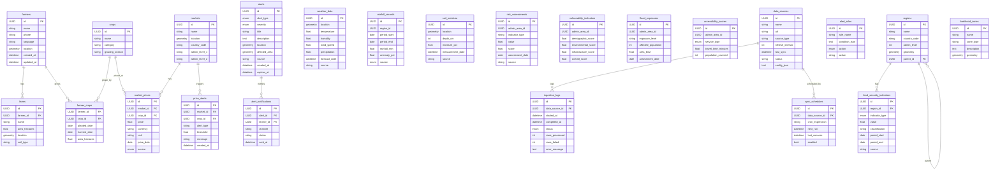

# Entity Relationship Diagram

```mermaid
erDiagram
    regions {
        UUID id PK
        string name
        string country_code
        int admin_level
        geometry geometry
        UUID parent_id FK
    }

    farmers {
        UUID id PK
        string name
        string phone
        string language
        geometry location
        datetime created_at
        datetime updated_at
    }

    farms {
        UUID id PK
        UUID farmer_id FK
        string name
        float area_hectares
        geometry location
        string soil_type
    }

    crops {
        UUID id PK
        string name
        string category
        string growing_season
    }

    farmer_crops {
        UUID farmer_id FK
        UUID crop_id FK
        date planted_date
        date harvest_date
        float area_hectares
    }

    markets {
        UUID id PK
        string name
        geometry location
        string country_code
        string admin_level_1
        string admin_level_2
    }

    market_prices {
        UUID id PK
        UUID market_id FK
        UUID crop_id FK
        float price
        string currency
        string unit
        date price_date
        enum source
    }

    price_alerts {
        UUID id PK
        UUID market_id FK
        UUID crop_id FK
        string alert_type
        float threshold
        string message
        datetime created_at
    }

    weather_data {
        UUID id PK
        geometry location
        float temperature
        float humidity
        float wind_speed
        float precipitation
        datetime forecast_date
        string source
    }

    rainfall_records {
        UUID id PK
        UUID region_id
        date period_start
        date period_end
        float rainfall_mm
        float anomaly_pct
        enum source
    }

    soil_moisture {
        UUID id PK
        geometry location
        int depth_cm
        float moisture_pct
        datetime measurement_date
        string source
    }

    risk_assessments {
        UUID id PK
        UUID admin_area_id
        string indicator_type
        float value
        float score
        date assessment_date
        string source
    }

    vulnerability_indicators {
        UUID id PK
        UUID admin_area_id
        float demographic_score
        float environmental_score
        float infrastructure_score
        float overall_score
    }

    flood_exposures {
        UUID id PK
        UUID admin_area_id
        string exposure_level
        int affected_population
        float area_km2
        date assessment_date
    }

    accessibility_scores {
        UUID id PK
        UUID admin_area_id
        enum service_type
        float travel_time_minutes
        int population_covered
    }

    alerts {
        UUID id PK
        enum alert_type
        enum severity
        string title
        text description
        geometry location
        geometry affected_area
        string source
        datetime created_at
        datetime expires_at
    }

    alert_rules {
        UUID id PK
        string rule_name
        text condition_json
        enum action
        string active
    }

    alert_notifications {
        UUID id PK
        UUID alert_id FK
        UUID farmer_id FK
        string channel
        string status
        datetime sent_at
    }

    data_sources {
        UUID id PK
        string name
        string url
        string source_type
        int refresh_interval
        datetime last_sync
        string status
        text config_json
    }

    ingestion_logs {
        UUID id PK
        UUID data_source_id FK
        datetime started_at
        datetime completed_at
        enum status
        int rows_processed
        int rows_failed
        text error_message
    }

    sync_schedules {
        UUID id PK
        UUID data_source_id FK
        string cron_expression
        datetime next_run
        datetime last_success
        bool enabled
    }

    livelihood_zones {
        UUID id PK
        string name
        string zone_type
        text description
        geometry geometry
    }

    food_security_indicators {
        UUID id PK
        UUID region_id FK
        enum indicator_type
        float value
        string classification
        date period_start
        date period_end
        string source
    }

    regions ||--o{ regions : "parent"
    farmers ||--o{ farms : "has"
    farmers ||--o{ farmer_crops : "grows"
    crops ||--o{ farmer_crops : "grown_by"
    crops ||--o{ market_prices : "priced_at"
    markets ||--o{ market_prices : "has"
    markets ||--o{ price_alerts : "triggers"
    alerts ||--o{ alert_notifications : "notifies"
    data_sources ||--o{ ingestion_logs : "logs"
    data_sources ||--o{ sync_schedules : "scheduled_by"
    regions ||--o{ food_security_indicators : "has"
```
